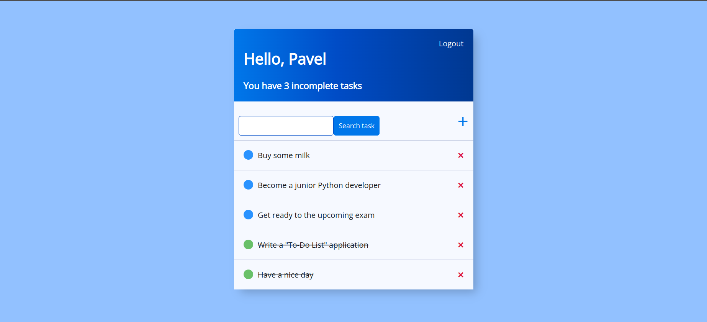
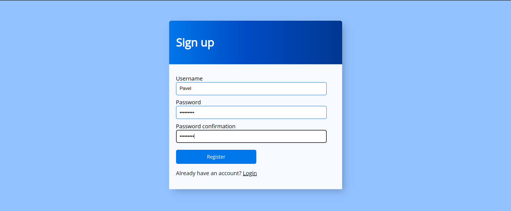

## Django "To-Do List" application
This is my Python Django "To-Do List" application, where I where I implemented a system for adding to the list and
removing tasks. You can change the content in each entry and change its status to "Completed". Also the searching option
was added.

In addition to the "To-Do List" application itself, I implemented a user registration and authentication system.
Thus, entries in the list of each of the users of the application are visible only to him.

### Installation
To install this application, you first need to clone this repository using the following command:

`$ git clone https://github.com/pbalkonskiy/django_todo_app.git`

After that you need to create your own virtual environment in `venv` file using commands:

`$ python3 -m venv /path/to/venv` or `$ python -m venv /path/to/venv`

And to activate it use the following:

`$ source /path/to/venv/bin/activate`

After creating the `venv` file you need to install all the packages from the `requirements.txt` file, which will be
cloned along with the repository. Just use the command:

`$ pip install -r requirements.txt`

### Application launch
After the installation process you can launch the application using terminal from the project cloned repository using
the following command:

`$ python manage.py runserver` or `$ python3 manage.py runserver`
